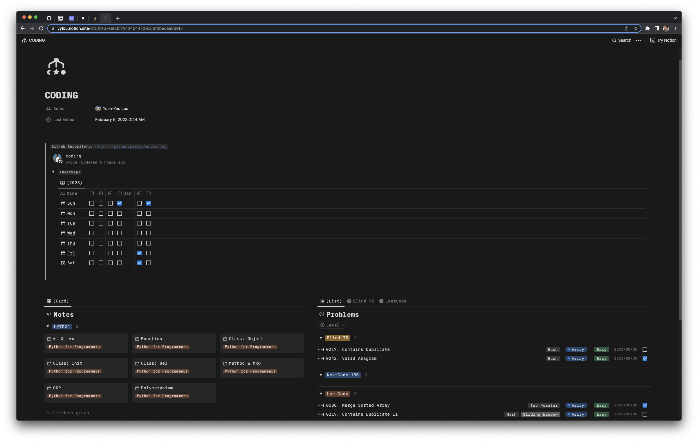
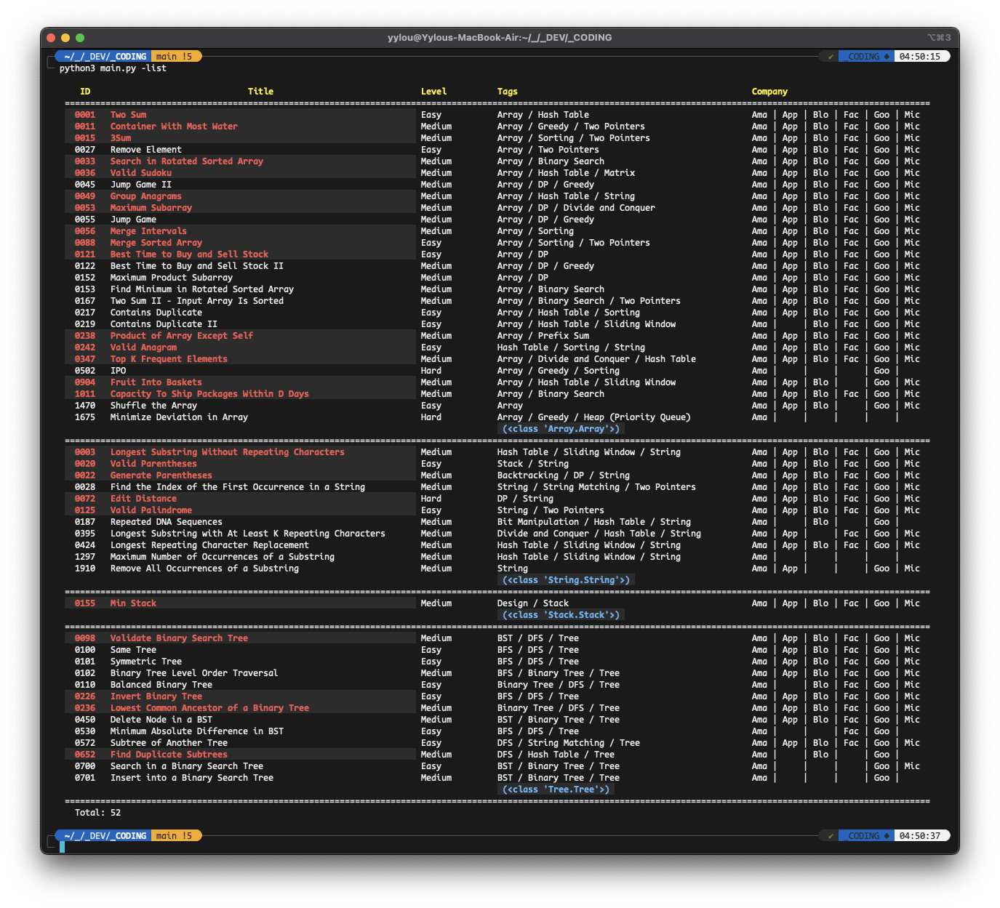
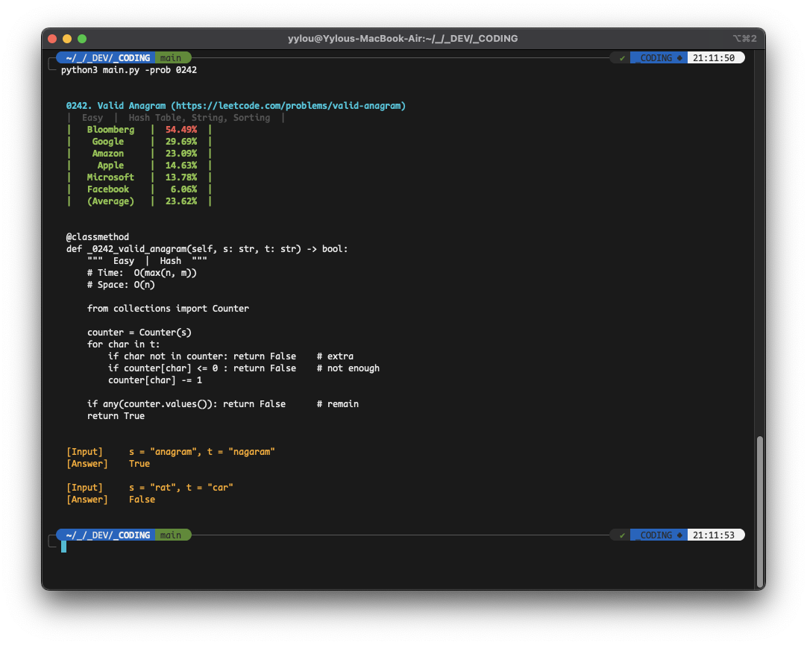

# Coding Practice
> [Notion Pages](https://yylou.notion.site/CODING-eef2bf79104b44709c56f0bedea8d9f5)
> 
> * #### Python Programming
>   * **Educative.io:** [```Python for Programmers```](https://www.educative.io/path/python-for-programmers) | [```Ace The Python Coding Interview```](https://www.educative.io/path/ace-python-coding-interview)
> * #### Problem Solving
>   * [```LeetCode```](https://leetcode.com/problemset/all/) | [```Blind 75```](https://www.techinterviewhandbook.org/best-practice-questions/) | [```NeetCode 150```](https://neetcode.io/roadmap)

<br />

## :round_pushpin: Show solved problems


## :round_pushpin: Interactive Mode
```python
>>> from Array import Array
>>> import inspect
>>> code = inspect.getsource(Array.search("0027"))
>>> print(code)
    @classmethod
    def _0027_remove_element(self, nums: list[int], val: int) -> int:
        """  Easy  |  Two Pointer  """
        # Time:  O(n)
        # Space: O(1)

        l, r = 0, len(nums)-1
        while r >= 0 and nums[r] == val: r -= 1             # skip duplicate

        while l <= r:
            if nums[l] == val:
                nums[l], nums[r] = nums[r], nums[l]
                r -= 1
                while r >= 0 and nums[r] == val: r -= 1     # skip duplicate
            else:
                l += 1
        return l
```

```python
>>> from Test import Test
>>> Test.run("0027", nums=[3,2,2,3], val=3)
[2, 2, 3, 3]
>>> Test.run("0088", nums1=[1,2,3,0,0,0], m=3, nums2=[2,5,6], n=3)
[1, 2, 2, 3, 5, 6]
```

## :round_pushpin: Execution Mode
